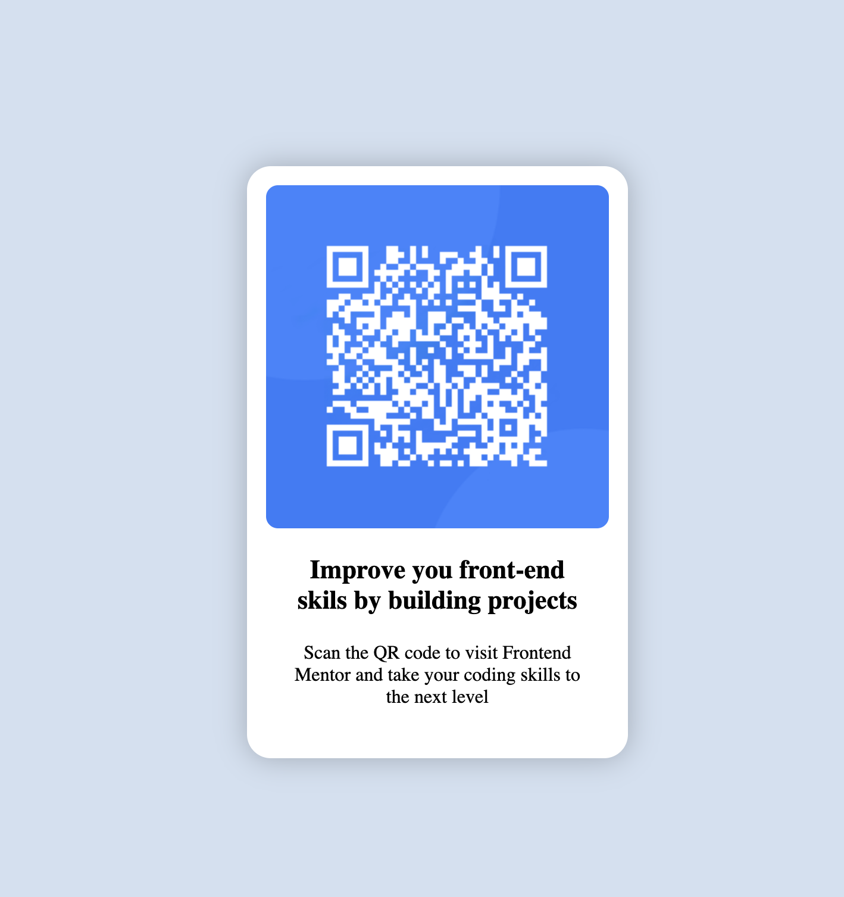

# Frontend Mentor - QR code component solution

This is a solution to the [QR code component challenge on Frontend Mentor](https://www.frontendmentor.io/challenges/qr-code-component-iux_sIO_H). Frontend Mentor challenges help you improve your coding skills by building realistic projects. 

## Table of contents

- [Overview](#overview)
  - [Screenshot](#screenshot)
  - [Links](#links)
- [My process](#my-process)
  - [Built with](#built-with)
  - [What I learned](#what-i-learned)
  - [Continued development](#continued-development)
  - [Useful resources](#useful-resources)
- [Author](#author)
- [Acknowledgments](#acknowledgments)

## Overview

### Screenshot



### Links

- Solution URL: [Add solution URL here](https://your-solution-url.com)
- Live Site URL: [Add live site URL here](https://your-live-site-url.com)

## My process

### Built with

- Semantic HTML5 markup
- CSS custom properties
- Flexbox
- CSS Grid
- Mobile-first workflow

### What I learned

I learned use styles and css to make on pure JS webpage

```html
<h1>thanks for that - https://github.com/neocotic/qrious</h1>
    <canvas id="qr-code"></canvas>
```
```css
.proud-of-this-css {
  & > p
}
```
```js
(function () {
  const qr = new QRious({
    element: document.getElementById("qr-code"),
    value: 'https://www.frontendmentor.io?ref=challenge'
  });
  //qr.background = '#0087FF';
  qr.backgroundAlpha = 0;
  qr.level = 'H';
  qr.size = 200;
  qr.foreground = '#FFFFFF';
})();
```

### Continued development

I will continue studying frontend..... 

### Useful resources

- [Example resource 1](https://github.com/neocotic/qrious) - This helped me for generate QR code. I really liked this very small generator and will use it going forward.

## Author

- Website - [Add your name here](https://www.my-site.com)
- Frontend Mentor - [@inecon](https://www.frontendmentor.io/profile/inecon)
- Twitter - [@saturnua](https://www.twitter.com/saturnua)

## Acknowledgments

Use docs, try be simple and clean(code)
